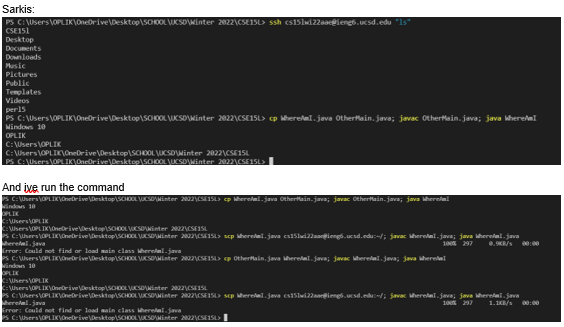

# ***Lab report of the first week lab***  
---
Auther: **[Sarkis Bouzikian](https://github.com/oplikos)**
---
* Im studing [computer engineering at UCSD][2]
* currently student of [Revelle College][3]
---
In week 2 of CSE15L, we did some example work on testing different layouts Using the MarkDown style in [Github][4] 
to explore the different output of Markdown assignment [Click here Example.md](https://oplikos.github.io/cse15l-lab-reports/example.html)

---
# The following is the week 1 activity
---
## Part 1
  
  the following image is the proof of successfully installing the Virtual studio code by following this link [click here][1]
  
---


---

## Part 2
 ```
for this part I had some issues with my vscode I wasn't able to connect to the school server using my vscode but then
I used moaXtreamto access the school server (other class account and remotely from that class access this class by studying the 
 ```


---
## Part 3
---

I use the window operating system for that reason I had to download a program called
OpenSSH, which is a program that can connect your computer to other computers
that have this kind of account:
[Install OpenSSH](https://docs.microsoft.com/en-us/windows-server/administration/openssh/openssh_install_firstuse)

to find CSE15L course-specific account [https://sdacs.ucsd.edu/~icc/index.php](https://sdacs.ucsd.edu/~icc/index.php)

Then, in Visual Studio Code, we are going to connect to the remote computer
using VSCode's remote option.  For reference, we're following the steps in
[“Connect to a remote
host”](https://code.visualstudio.com/docs/remote/ssh#_connect-to-a-remote-host)
step.

For the first step, open a terminal in VSCode (Ctrl or Command + \`, or use the
Terminal → New Terminal menu option).

```
$ ssh cs15lwi22zz@ieng6.ucsd.edu
```
but the `zz` should be replaced by your class id 

### Example of the output when connecting for the first time 
```
⤇ ssh cs15lwi22zz@ieng6.ucsd.edu
The authenticity of host 'ieng6.ucsd.edu (128.54.70.227)' can't be established.
RSA key fingerprint is SHA256:ksruYwhnYH+sySHnHAtLUHngrPEyZTDl/1x99wUQcec.
Are you sure you want to continue connecting (yes/no/[fingerprint])? 
```


---
## Part 4
---
running some commands in the terminal susch as 
- `cd ~`
- `cd`
- `ls -lat`
- `ls -a`
- `ls <directory>` where `<directory>` is
`/home/linux/ieng6/cs15lwi22/cs15lwi22abc`, where the `abc` is replace by my personal class signiture 
- `cp /home/linux/ieng6/cs15lwi22/public/hello.txt ~/`
- `cat /home/linux/ieng6/cs15lwi22/public/hello.txt`


---
## Part 5
---
this part was about to create a java file with the following code 

```
class WhereAmI {
  public static void main(String[] args) {
    System.out.println(System.getProperty("os.name"));
    System.out.println(System.getProperty("user.name"));
    System.out.println(System.getProperty("user.home"));
    System.out.println(System.getProperty("user.dir"));
  }
}
```
and save it to the local computer then 
using `scp command 
```
scp WhereAmI.java cs15lwi22zz@ieng6.ucsd.edu:~/

```

sending it to the remote computer 


---
## Part 6
---
this part is to create ssh-keygen, which creates a pair of files called the public key and private key to gain easy access to our class directory

the following should be the set of code to expect but when we first did it ssh wasn't working on my local computer so I had to delete the ssh client and reinstall it to work (in case a window user gets this kind of error

```
# on client (your computer)
$ ssh-keygen
Generating public/private rsa key pair.
Enter file in which to save the key (/Users/joe/.ssh/id_rsa): /Users/joe/.ssh/id_rsa
Enter passphrase (empty for no passphrase): 
Enter same passphrase again: 
Your identification has been saved in /Users/joe/.ssh/id_rsa.
Your public key has been saved in /Users/joe/.ssh/id_rsa.pub.
The key fingerprint is:
SHA256:jZaZH6fI8E2I1D35hnvGeBePQ4ELOf2Ge+G0XknoXp0 joe@Joes-Mac-mini.local
The key's random art image is:
+---[RSA 3072]----+
|                 |
|       . . + .   |
|      . . B o .  |
|     . . B * +.. |
|      o S = *.B. |
|       = = O.*.*+|
|        + * *.BE+|
|           +.+.o |
|             ..  |
+----[SHA256]-----+
```

If you're on Windows, follow the extra `ssh-add` steps here: [https://docs.microsoft.com/en-us/windows-server/administration/openssh/openssh_keymanagement#user-key-generation](https://docs.microsoft.com/en-us/windows-server/administration/openssh/openssh_keymanagement#user-key-generation)


---
## Part 7
---

this part is when i did it the first time my ssh didn't work so I had to redo this week and counted
how many keystrokes took me to run the commend 
starting by selecting the code  it was
`select->ctr+C->click->crt+v->enter->click->select->crt+c->click->ctr+v->enter`
in total of `11` key strokes to complete the assignment 



---
[1]: https://code.visualstudio.com/docs
[2]: https://ece.ucsd.edu/undergraduate/undergraduate-programs/computer-engineering-major
[3]: https://builder.guidebook.com/g/#/guides/revelle/details
[4]: https://github.com/

 [BACK TO MAIN](https://oplikos.github.io/cse15l-lab-reports/){: .btn}
 https://oplikos.github.io/cse15l-lab-reports/
<button name="BACK TO MAIN">Click me<https://oplikos.github.io/cse15l-lab-reports/>
  
  <button name="button">Click me</button>
