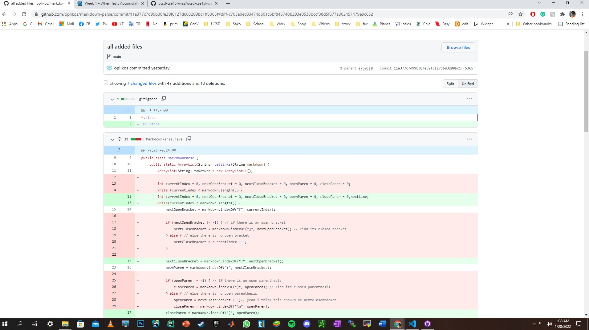
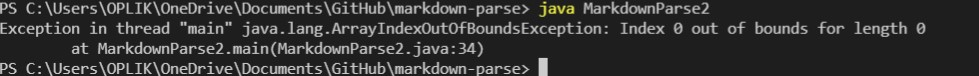
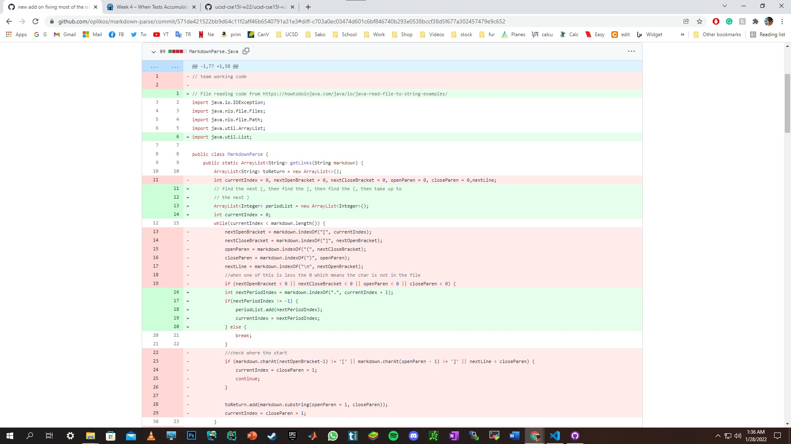
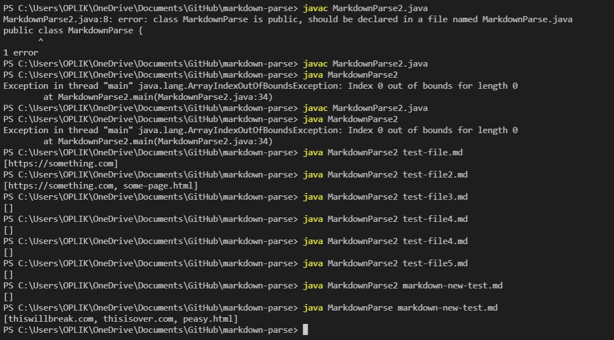
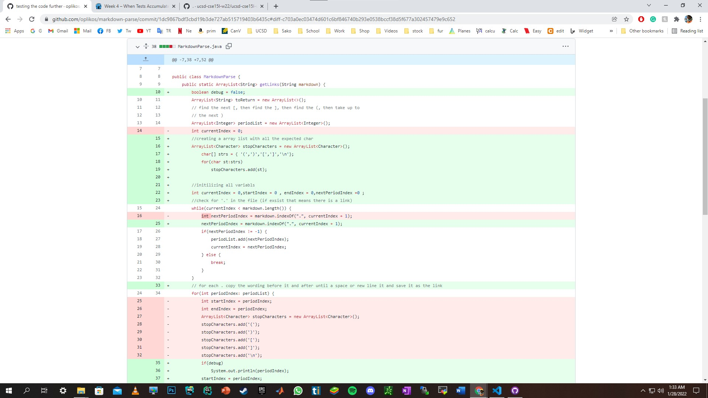
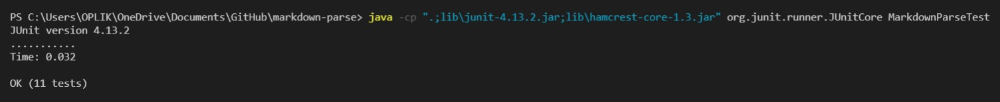
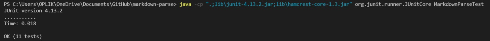

# ***Lab report of the week 3 and 4 lab section A***
---
Auther: **[Sarkis Bouzikian](https://github.com/oplikos)**
---
## Fix 1
---
In the week 3 lab the understanding of the software and its bugs were limited but when we start the lab everything became clear.
getting the raw file from the professor and running out the first test to explore the potential output of the software 
we start to realize the extent of the bugs in the program, our first few attempts were to fix one char at a time such as

``'['``, ``']'`` , ``'('`` , ``')'``.

the first fix we attempt is to add a couple of statements to monitor if there is a bracket or not and to skip that test eventually
I come up with one statement that combines all the if statements
```
 if (nextOpenBracket < 0 || nextCloseBracket < 0 || openParen < 0 || closeParen < 0) {
                break;
            }
 ```
 
to trace the History of this edit please click on the [link][1] 



the following the screenshot of the error 



---
## Fix 2
---
in this part, we realized in week 4 test 7 from the assignment that our approach to solving this program is wrong to fix this issue we change the entire program to a different approach where the program first looks for a ``'.'`` in the file and goes left and right until it reaches a ``space`` ``(`` ``)`` ``[`` ``]`` ``'\n'`` and saves all the characters between the start index and end index into the ArrayList

to trace the History of this edit please click on the [link][2] 



the following the screenshot of the error 



---
## Fix 3
---
this part is when I revise the program we finish the class after fixing all the issues and trying to optimize the time of the run 
in this part, I change the place of creation of ``stopCharacters`` and place it on top where is out of the loop it doesn't get create many times with the loop, and optimize it to 3 lines of code instead 6 lines of code

**From**
```
ArrayList<Character> stopCharacters = new ArrayList<Character>();
            stopCharacters.add('(');
            stopCharacters.add(')');
            stopCharacters.add('[');
            stopCharacters.add(']');
            stopCharacters.add('\n');
```
**to**
```
ArrayList<Character> stopCharacters = new ArrayList<Character>();
            char[] strs = { '(',')','[',']','\n'};
            for(char st:strs)
                stopCharacters.add(st);
```
to trace the History of this edit please click on the [link][3] 


* first run without the optimazation result of 0.032 second

* after optimazation result of 0.018 second 



[1]: https://github.com/oplikos/markdown-parse/commit/11a377c7d99b38fe39f6127d603209bc1ff5365f#diff-c703a0ec03474d601c6bf846740b293e0538bccf38d5f677a302457479e9c652
[2]: https://github.com/oplikos/markdown-parse/commit/571de421522bb9d64c11f2aff46b6540791a31e3#diff-c703a0ec03474d601c6bf846740b293e0538bccf38d5f677a302457479e9c652
[3]: https://github.com/oplikos/markdown-parse/commit/1dc9867bdf3cbd19b3de727ab515719403b6435c#diff-c703a0ec03474d601c6bf846740b293e0538bccf38d5f677a302457479e9c652
