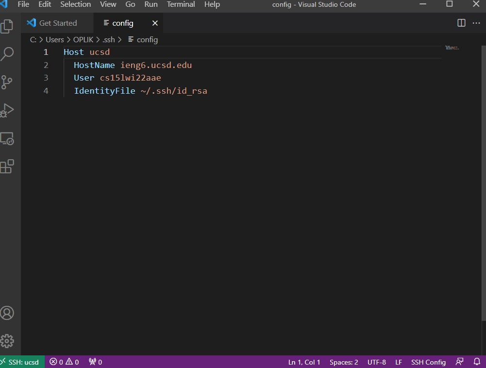
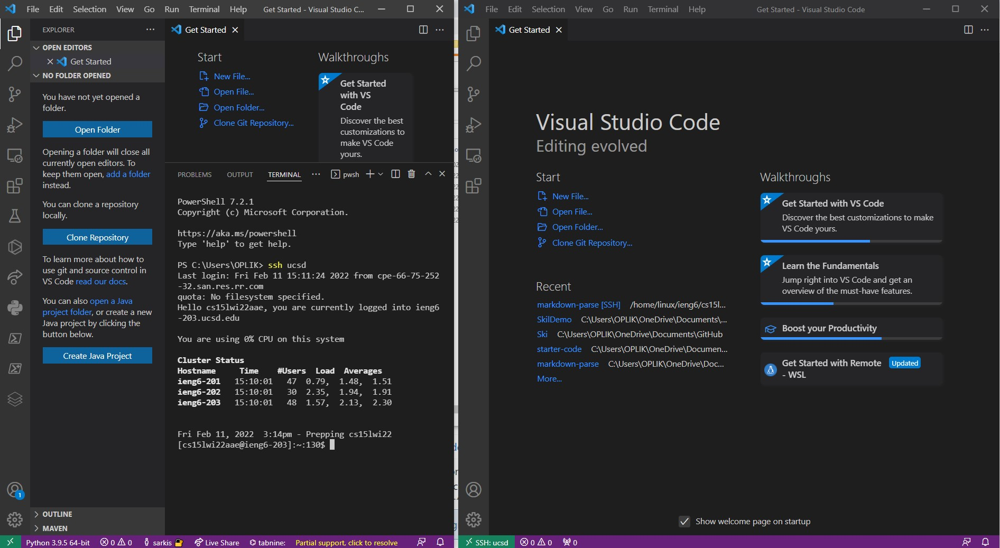
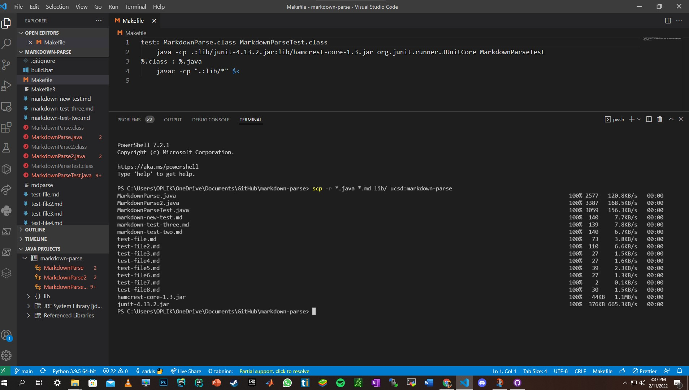

# ***Lab report of the week 5 and 6 lab section A***
---
Auther: **[Sarkis Bouzikian](https://github.com/oplikos)**
---
## The Choice going with Streamlining ssh Configuration
---
```
Show your .ssh/config file, and how you edited it (with VScode, another program, etc)
```
---
the foloowing picture is the config file i set it with the key file to log in with minimun strocks ( terminal ssh took me 3 sec )
by greenbutton on the right took me 2 sec )  to log in 
 

---
```
Show the ssh command logging you into your account using just the alias you chose.
```
---
the following image is the screen shot of both ways loging in to ssh on the left side is by going to terminal and doing ssh ucsd
(ive change it from ieng6 o ucsd eayser for me to remeber)
and on the right side is by clicking the green button on the left buttom corner where you have set up a congif file with all the
credentials and by just clicking on the name you will be logged in and get access to all the files in the server.


---
```
Show an scp command copying a file to your account using just the alias you chose.
```
---
for this part i learn new thing from trying other groups cmd where by doing the following cmd you will copy on the mentioned files such as the
```*.java``` and ```*.md``` will only copy th e java amd md files in the directory and for the lib/ it is copying all the fils in that directory
and by using ```ucsd``` im skipping the step where i have to put on my school name .. by using the short cut created in earlier step
```
 scp -r *.java *.md lib/ ucsd:markdown-parse
 ```
 
---
[BACK TO MAIN](https://oplikos.github.io/cse15l-lab-reports/)
