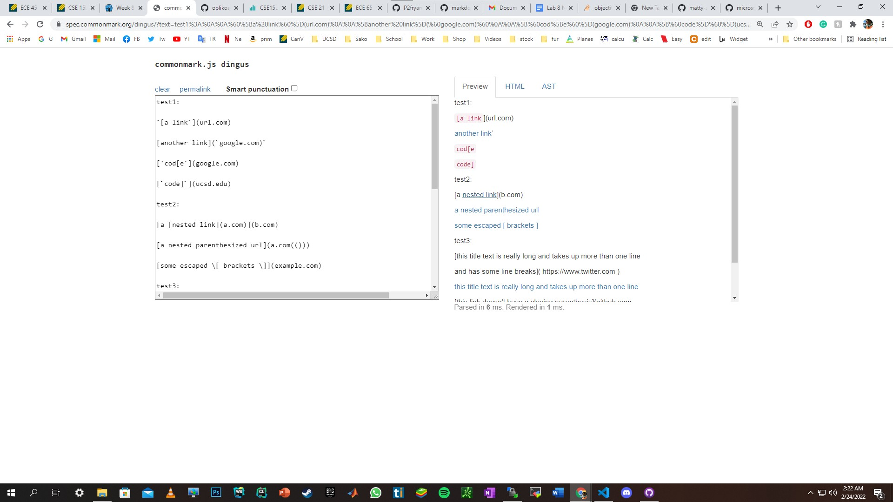
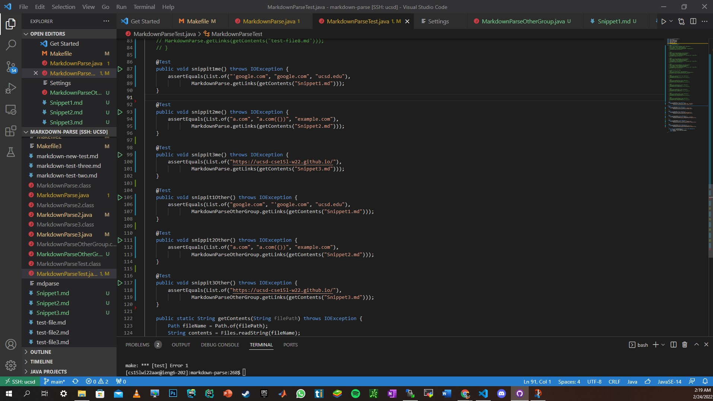
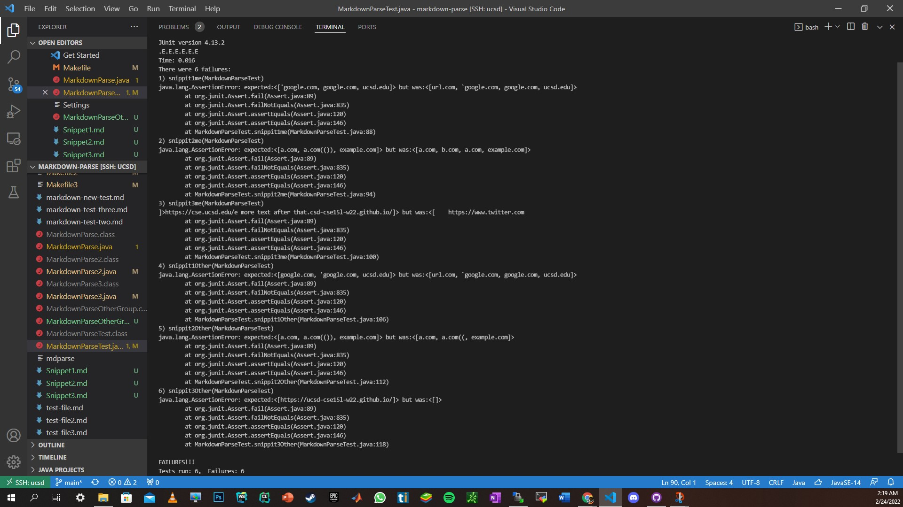

# ***Lab report 4 of the week 7 and 8 lab section A***
---
Auther: **[Sarkis Bouzikian](https://github.com/oplikos)**
---
[lab report 4 link](https://ucsd-cse15l-w22.github.io/week/week8/#week-8-lab-report)
---

# Part 1:

---

[My MarkdownParse repository link](https://github.com/oplikos/markdown-parse)

[MarkdownParse that i reviewed repository link](https://github.com/P2fryang/markdown-parse)

---

# **Part 2:**

according to the commonmark.js and individually investigating the snippet file in Github the result for the 
```
Sinppet1 = "'google.com", "google.com", "ucsd.edu"
Sinppet2 = "a.com", "a.com(())", "example.com"
Sinppet3 = "https://ucsd-cse15l-w22.github.io/"
```
only the following links got active when the snippet file are introduced to common mark and Github



---

# **Part 3:**

---

the following picture is the 6 test cases first 3 is the test case using my markdown parser and the remaining is the other group's revied code for markdownparse



---

the following picture is the result of all the test cases mine and the other group where our code failed all the test cases and non of the method was successful



---

# **Part 4:** 

---

for **Snippet 1:** yes there can be an easy fix by adding a condition check before the ```"["``` to check if it contains any char so that the following can not be considered as link

---
for **Snippet 2:** not sure if there is an easy fix my code managed to read the nested link which the GitHub and commamark.js failed to realized that and was able to clear out unnecessary char from the link ```a.com(())``` my code fixed that to a.com without ```(())``` to fix the second is to check if there is an open ```"("``` right after the to keep reading until it gets a 2 ```")"``` is there is more the integer keeps adding up (maybe a recursive function will do the job) but for the nested link I think my code performed better then the markdown itself cause it was able to read the nested link

---
for **Snippet 3:** my code failed to read the actual valid link but was able to pick up the one after with return so to fix this issue I can add a simple stop looking for ```")"``` when there is a ```"\n"``` return char and to fix the part (that didn't read the link I think is possible to change the while loop to keep on looking the for link after ( even when there is a return char 

---
[BACK TO MAIN](https://oplikos.github.io/cse15l-lab-reports/)
