# ***Lab report 5 of the week 9 and 10 lab section A***
---
Auther: **[Sarkis Bouzikian](https://github.com/oplikos)**
---

just in case you want to check the markdown parse (mine) and the markdown pasee (main) and the files created (me.txt main.txt result.txt)
[click here](https://github.com/oplikos/markdown-parse/tree/main/markdown-parse-main-week9)

---

running bash on my script.

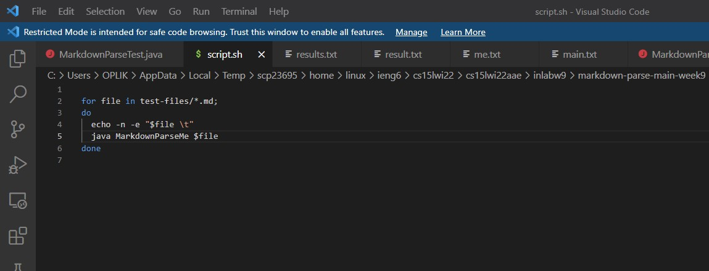

my script results

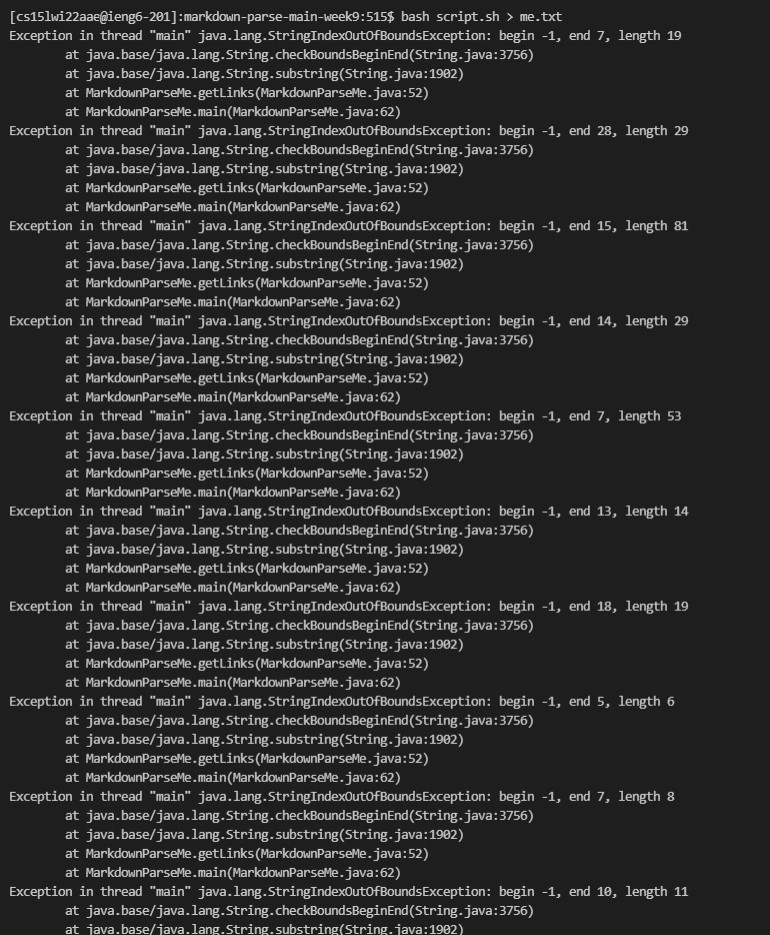

changing scripts to run on main markdown parse

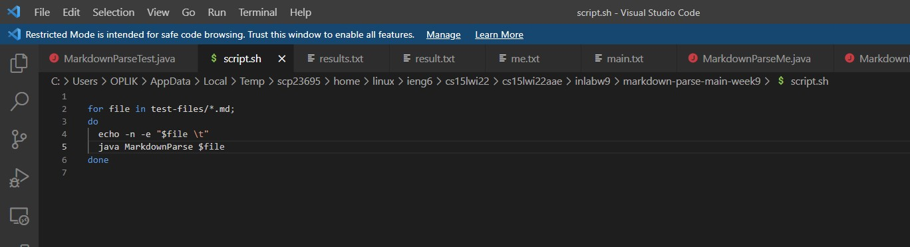

running bash script on the main and exporting result to main.txt and then do ```diff```

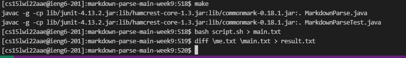

comparing the results and checking what went wrong 

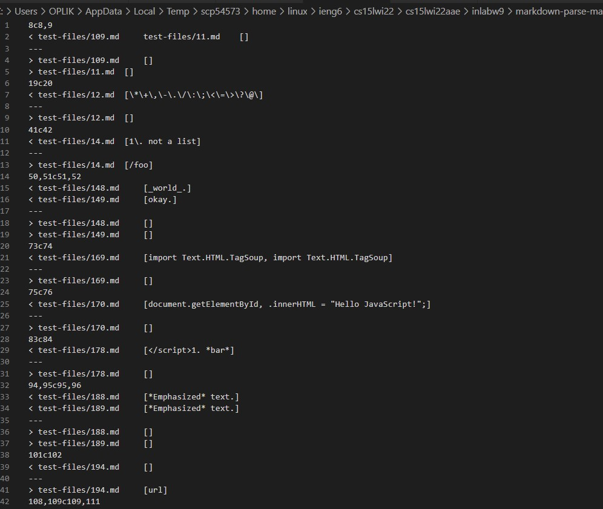

according to my bash run, I can see that I have a couple of results fail due to 
```
java.lang.StringIndexOutOfBoundsException:
```
and the test file 148 and 149 I got exported link where the main code did not

for files 148 and 149 I got results because ive changed my code completely and made it as it reads the ```.``` and grabs the link that is in between the ```(  )``` but that approach of my code failed due to that the file 148 and 149 don't contain any links which will not produce the proper result

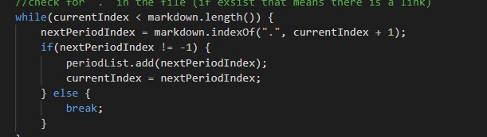

fix: I should add an if statement where if there are no words after ```.``` in this case I should not grab the link name and add it to the array so skipping the sentences that are not complete as a link 


and the part that ```java.lang.StringIndexOutOfBoundsException:``` to examine this issue I run the bash solo to see which files are causing it and open those files up to see what is a common issue in between 

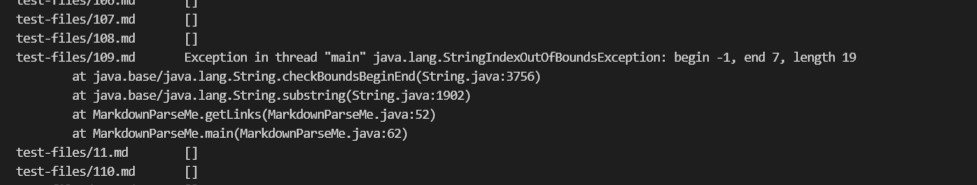

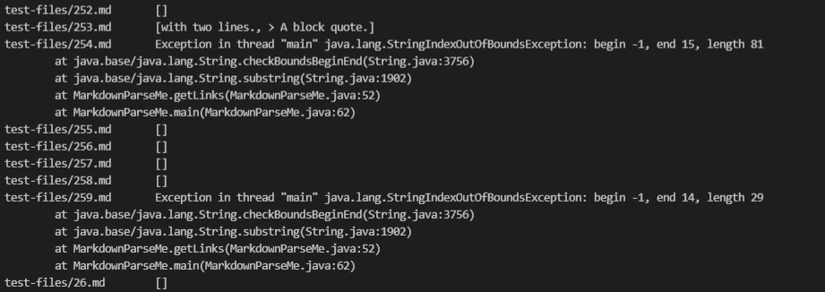

the file 259 for example 

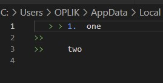

and the issue noted here is that file 259 and the other one don't contain any ``` [, ], (, ) ``` which is the result should be an empty string but my code is crushing to fix this issue all I have to do is check if the file does not contain any ``` [, ], (, ) ``` then return an empty string.

fix: adding an if statement to check if there is ```[``` in the file 

result of fixing both issues 

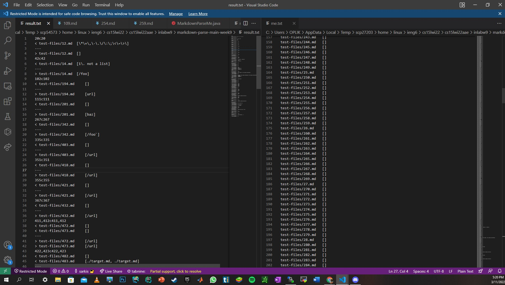

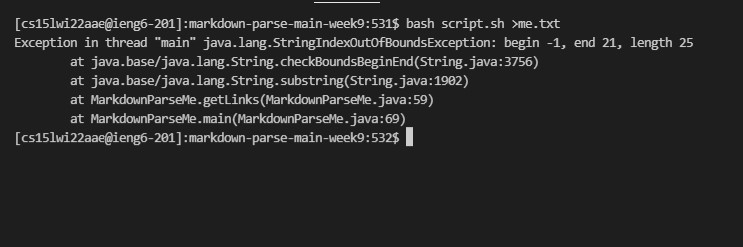


as shown in the last picture the bash command on my markdown parse this time given only one exception error where at the beginning was way too many and from  the other picture I can see that from the file 14 till 194 I have no issues where before I had plenty by fixing those 2 issues i reduce the mismatches to 10% 

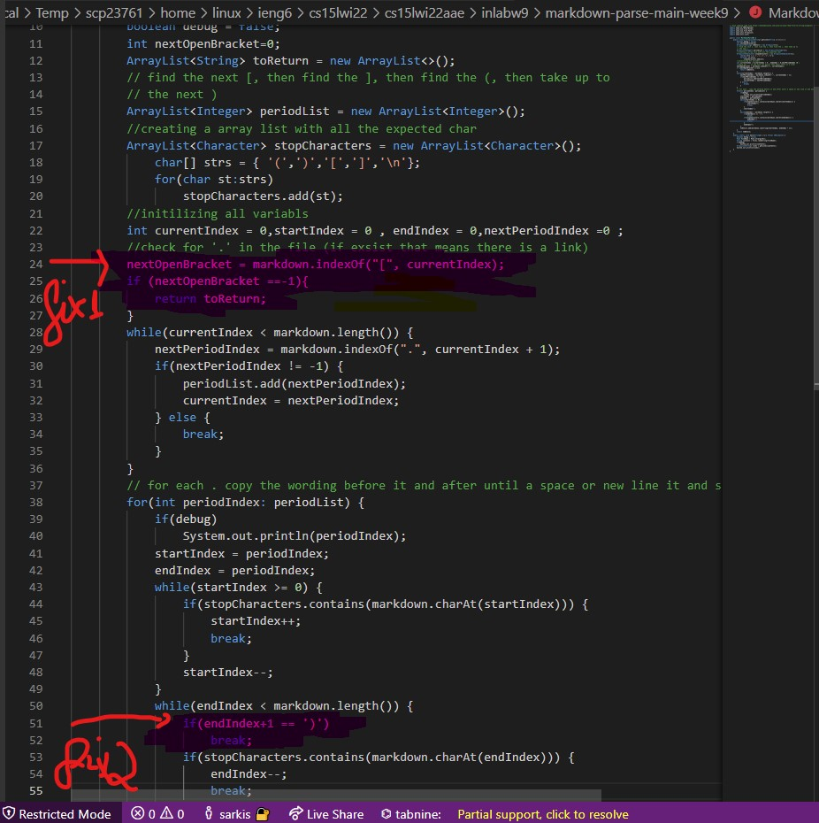
---
[BACK TO MAIN](https://oplikos.github.io/cse15l-lab-reports/)
